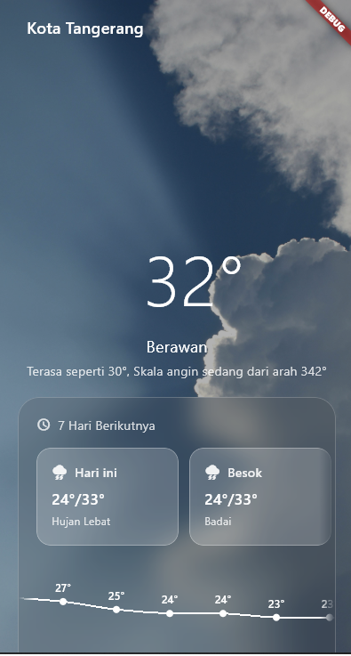
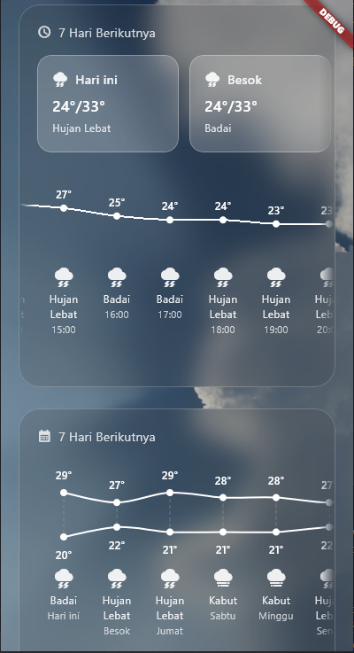
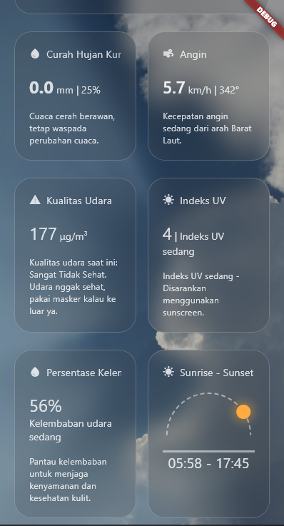

# 🌤️ Flutter Weather App

A simple yet powerful weather forecasting application built using Flutter, fetching real-time data from [Open-Meteo](https://open-meteo.com/) and IP-based location detection using [ip-api.com](http://ip-api.com/json/).

> ⚠️ This app is currently under active development. Language support is limited to **Bahasa Indonesia only** for now.

---

## 🚀 Features

- **📍 Location Detection**  
  Automatically detects user location using **GPS** or **IP address** to provide relevant weather data.

- **🌡️ Current Weather**  
  Displays current temperature and weather conditions including:
  - "Feels like ... °C"
  - Wind direction scale (e.g., from ...°)

- **📅 7-Day Forecast (Daily)**  
  - Minimum and maximum temperature
  - Weather prediction for the next 7 days

- **⏱️ 7-Day Forecast (Hourly)**  
  - Hourly temperature and weather
  - Hourly rainfall accumulation
  - Hourly wind speed and direction
  - Hourly air quality index (AQI)
  - Hourly UV index
  - Hourly humidity percentage

- **🌅 Sunrise & Sunset Data**  
  - Daily sunrise and sunset times for the next 7 days

---

## 📡 Data Sources

- **Weather & Environmental Data**:  
  Powered by [Open-Meteo API](https://open-meteo.com/)

- **IP Geolocation**:  
  Using [ip-api.com](http://ip-api.com/json/) for fallback location detection

---

## 📱 Platform

- Built using **Flutter**
- Targeting **Android** devices

---

## 🛠️ Status

This project is still a **work in progress**. Expect bugs, incomplete features, and UI inconsistencies. We're actively working on expanding language support and polishing the user interface.

---

## 📸 Screenshots

  
  
  

---

## 💡 Coming Soon

- Device Optimization
- Multi-language support (English & more)
- Better error handling for network failures
- Offline weather caching
- User-selectable locations

---

## 📬 Feedback & Contributions

Feel free to open issues or submit PRs if you want to contribute or report bugs!

---

## 🔖 License

This project is open-source and available under the [MIT License](LICENSE).
